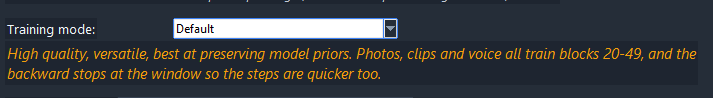
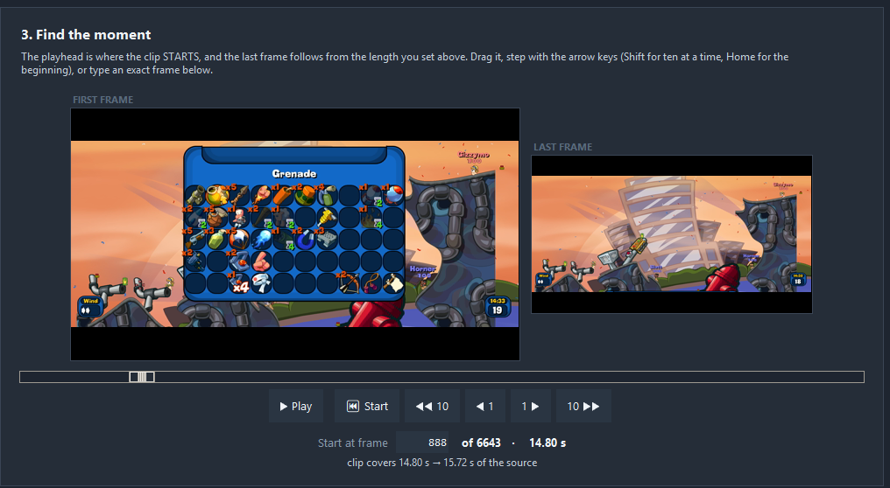
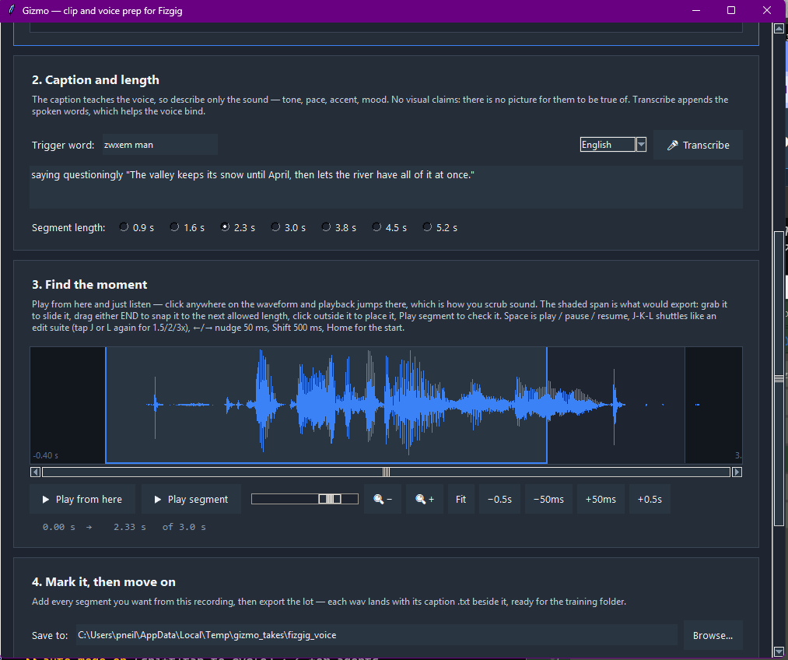

# MiniMax H3

[← Back to the README](../README.md)

Fizgig trains LoRAs for **MiniMax H3**, MiniMax's open-weight ~33B video model, on a single consumer GPU, from still images, **short video clips, their sound, and voice recordings** ([details ↓](#training-on-video-clips-and-their-sound)). Output loads straight into ComfyUI's H3 workflows, including the pruned inference builds.

H3 trains, previews and pauses/resumes like the other families, and all five workbench tools work on H3 LoRAs, with previews rendered as short clips ([Repair Studio](#repair-studio-on-h3) plays them; the other tools judge the middle frame). Those tools, run on real LoRAs, produced the block map behind the training modes below. Full fine-tuning of the H3 base is covered in [Full fine-tuning](FINETUNE.md).

## Getting started and VRAM

Pick **MiniMax H3** from the Base Model selector and the usual flow applies: Start-tab folder, Captions, Samples, Training. Leave **Blocks Swap** and **Base Precision** on Auto. At launch the trainer reads your **free** VRAM (close ComfyUI first) and picks the base precision and block-swap count together:

| Free VRAM | What Auto does |
|---|---|
| ~30 GB | **int8**, no block swap, up to 1 MP |
| ~22 GB | **int8**, ~14 blocks streamed |
| ~15 GB | **int8**, ~36 blocks streamed |
| ≤12 GB | **4-bit** |

int8 is the checkpoint's own storage and the most accurate base (~0.17% error). **4-bit HQQ** sits between the two (~4.8% base error, ~15 GB on the pruned checkpoint) and is an explicit pick under Base precision that Auto never makes (contributed by [@rintic-13](https://github.com/rintic-13), [#102](https://github.com/shootthesound/Fizgig/issues/102)). Where blocks stream, on the 12–24 GB tiers it exists for, the dequant hides behind the transfers and group 16 runs level with NF4 (group 8 measured ~6% slower on a 16 GB card); on a big card with nothing streamed it runs at roughly half NF4's step speed, group 8 a further ~15% slower.

Block swap **streams one way only**, ~6.4× faster than round-trip swap, which is what lets 16 and 24 GB cards keep the accurate base (design contributed by [@rintic-13](https://github.com/rintic-13), [#73](https://github.com/shootthesound/Fizgig/issues/73)). Hit an OOM anyway? Set Blocks Swap to a number to override the planner.

Every H3 LoRA step on the int8 base runs [@rintic-13](https://github.com/rintic-13)'s fused forward kernel and [@mabseyuk](https://github.com/mabseyuk)'s fused backward.

On 16 GB-class cards, previews cap themselves at **768×640 and 22 frames** (sound kept); larger picks in the menus clamp, with a console note. On 24 GB cards clip previews clamp to **22 frames** for the same reason (resolution untouched); lower Target Megapixels if you want the 56-frame preview back on that tier.

**12 GB cards + previews (Windows): leave the paging file system-managed.** Each preview parks the training model and optimizer in system RAM while the decoder runs, and a fixed small paging file (e.g. 4 GB) can't cover that commit spike. The run dies with **Windows error 1455** ("paging file is too small"), which says nothing about previews. Settings → System → About → Advanced system settings → Performance → Advanced → Virtual memory → *Automatically manage*. Reported and confirmed on a 12 GB RTX 5070 by [@mabseyuk](https://github.com/mabseyuk).

## Presets

Three built-in presets ship; **Fast** applies the moment you pick the family:

| Preset | Settings |
|---|---|
| **✨ MiniMax H3 Fast (LoRA 8, 50 epochs)** | LoRA dim/alpha **8, 50 epochs, Automagic v3 from 1e-6**, **0.25 MP**, Training Structure **Likeness and Style**. Reaches likeness in a few hundred steps, and the lower rank tends to come out more flexible |
| **✨ MiniMax H3 (rank 16, 60 epochs)** | The same at **rank 16, 60 epochs**, for larger datasets and longer trains |
| **✨ MiniMax H3 Style (LoRA 8)** | The Fast preset's settings, minus the clips' sharp-face stills: style is about the look, not the face |

## Training mode

**Training mode** picks the recipe. Use **Default**: it is high quality, versatile, and the best of the three at preserving what the model already knows. Photos, clips and voice all train the identity blocks (**20-49**), and because the backward stops at that window the steps are quicker too. Styles train faster and better on it, and every preset ships it.

**More Blocks** trains **6-49** on every step type. It preserves less of the model's priors, can affect movement ability, and steps more slowly, since the backward covers 44 blocks instead of 30. The name is about coverage, not quality: it is **not** a likeness upgrade, and Default reaches higher likeness sooner with quicker steps. Its possible use is **training a motion concept**, since it reaches more of the model; whether Default is enough there too needs more testing.

**Off** hands the blocks to you (see **Blocks to Train** below), for experiments.

In every mode the LoRA leaves the model's text token refiner alone, and blocks 0-5 are trained by nobody but you: they deform anatomy and pull the dataset's colour into the render.

## Optimizer

Every H3 preset runs **automagic3**, the Automagic v3 optimizer (MIT, see [THIRD_PARTY_NOTICES.md](../THIRD_PARTY_NOTICES.md)), started at 1e-6. It sets its own learning rate from the update signs, one rate for the whole LoRA, rising while the signs hold steady and falling while they alternate. In practice it warms up over the first couple of epochs, then anneals a few percent an epoch. The Learning Rate box is only its start, so leave it at 1e-6 rather than an AdamW number. The scheduler, Adaptive LR, the adapter ramp and band multipliers all stand down while it owns the rate. Krea 2's Optimizer Type row lists it too, with the same rules.

The Optimizer Type dropdown also offers full-precision **adamw**, which measured as the single biggest likeness gain on H3 and is the right choice when you want a rate that does not move. For a style set, adamw is worth trying: its images all share the look being learned, so the signs agree for longer and automagic3 pushes harder than you want.

## Training adapter

A frozen LoRA rides at full strength on every training step, so the gradient goes into your subject rather than into undoing H3's guidance distillation. It is off for previews and never written into your LoRA. The **Training adapter** dropdown picks which one:

- **Circlestone** ([circlestone-labs](https://huggingface.co/circlestone-labs/MiniMax-H3-Image-Training-Adapter)) is the default and the one for photos. In A/Bs on the same data it trained sharper, cleaner LoRAs that follow the prompt better. One file serves both the fl2va and ref2va bases.
- **Ostris** ([@ostris](https://github.com/ostris), [training adapter](https://huggingface.co/ostris/minimax_h3_training_adapter)) is the one for videos: on a video-only style run it learned the look about three times faster. The Training tab suggests it when it sees a clips-only dataset. It comes as fl2va and ref2va files; the one matching your Training Base is used. Against no adapter, with likeness mode on, it reached 50% likeness seven epochs sooner and peaked higher, and its best window arrives earlier, so watch the gallery.
- **Off** trains without one.

For a mixed dataset, choose by whether the photos or the videos are the priority. The updater and the Preferences download buttons fetch the adapter files. The adapter used is recorded in the output metadata. It also rides under full fine-tuning (forward hooks, on by default, never in the checkpoint); see [FINETUNE.md](FINETUNE.md).

## Context LoRA

Pick any existing H3 LoRA (AI-Toolkit files load as-is) and it rides frozen under the one you're training, in training and in previews, so the new LoRA learns to coexist with it and previews show the pair as you'll deploy it. The context LoRA is recorded in the output metadata. LoRA runs only, not fine-tuning.

## Resolution and previews

**0.25 MP is the default.** It is four times cheaper per step than 1 MP, and the extra resolution has not paid for itself in testing. Raise it if a specific dataset asks for it.

**Previews default to 768×768, 56-frame clips with sound**, opened in the gallery as a playable video (never autoplay). Without the audio VAE set, clips render silent; stills and other lengths are in the dropdown. Set the **Turbo LoRA** in Preferences and previews render in **6 steps instead of 20** (previews only, never the saved LoRA).

On a plan that streams blocks (a 24 GB card on the int8 base), clip previews clamp to **22 frames up front**: the plan leaves previews ~4 GB and a 56-frame clip doesn't fit there, so the trainer says so once and renders the 22-frame clip. A preview that still outgrows VRAM steps down a ladder rather than failing (a shorter clip first, then resolution to a 512×512 floor), and the size that fit is saved as the new default.

## Model files

Each has a **Download link on its row in Preferences**:

| Model | Size | Notes |
|---|---|---|
| DiT — pruned int8 | ~21 GB | The training base, `minimax_h3_fl2va_pruned_int8_convrot.safetensors`, the same file ComfyUI runs. The ~66 GB bf16 file also works for LoRA training (NF4 at load), but [full fine-tuning](FINETUNE.md) needs the int8 file |
| Qwen3-VL-32B text encoder | ~15.7 GB | The **nvfp4** file, the same one ComfyUI uses. Loaded once for caching, then freed |
| Video VAE | ~4.9 GB | Caching and preview decode |
| Audio VAE *(optional)* | ~605 MB | Sound training and previews with sound |
| Turbo LoRA *(optional)* | ~780 MB | 6-step previews, `minimax_h3_turbo_v4_step600.safetensors` from [larryvrh/MiniMax-H3-Turbo-Lora](https://huggingface.co/larryvrh/MiniMax-H3-Turbo-Lora); you may already have it in ComfyUI's loras folder |
| DiT — reference *(optional)* | ~21 GB | Only for reference distillation (`ref2va`) |
| Training adapter (Circlestone) | ~620 MB | The default training adapter, one file for both bases |
| Training adapter (Ostris) *(optional)* | ~155 MB each | fl2va and ref2va files, used when the dropdown says Ostris |

**You train on the pruned file.** "Pruned" here swaps the AdaLN modulation MLP for a curve table. That branch only sees the timestep, so nothing a LoRA learns lives there: you train against the exact weights you deploy on.

## Training-tab controls

Every control has a hint in the app; the ones worth knowing:

- **Training Structure** (default **Likeness and Style**): how much of the run trains on nearly-clean images, where likeness *and* style live. **Model default, movement** is the reference trainer's schedule; **Custom** exposes the raw percentage. Leave **Medium to High Noise LR** beside it at 100.
- **Training mode** (default **Default**): see [Training mode](#training-mode). Confining clips to Default's blocks trains video just as well and makes clip steps far lighter on VRAM.
- **Train the text token refiner** (default Off, in Other Options): leave it off. It does not affect the ability to use a trigger word. The refiner sets how every prompt is read; training it softens output and makes previews judder between epochs. LoRA runs only.
- **TREAD token routing** (default On, LoRA runs): on every clip step a random half of the video tokens leaves the sequence at block 2 and rejoins at block 47 unchanged, so 45 of the 50 blocks process half the tokens (Krause et al., arXiv 2501.04765). Clip steps get markedly faster; the trained LoRA is an ordinary LoRA and previews never route. Photos, and the clip stills below, always run in full: a still has no neighbouring frames to lean on, and it is where the sharp identity signal lives. Untick to A/B against a plain run.
- **Also train each clip's sharpest face frame as a photo** (default On): when clips are cached, every frame is scored for focus on the face itself (so subject motion blur decides, not background texture), and the sharpest frame that shows a face is encoded as a still. It trains on a step of its own with the clip's caption: a sharp second look at every subject, at no cost to the clip step. Voice items are unaffected. Clips cached without a pick use frame 0 until the next launch's cache step adds picks to just those clips.
- **Blocks to Train**: hand-pick a subset of H3's 50 blocks. Live only when Training mode is **Off**; the other modes own the choice and grey it out with a note. The measured recipes: **`6-49`** for the whole model (More Blocks), **`20-49`** for likeness (Default), voice core `38-48`. Type ranges (`3-12, 22, 31-33`) to experiment beyond them. Blocks 0-5 are in none of them: they deform anatomy and pull the dataset's colour into every render.
- **Reference distillation** (experimental): teaches the LoRA to render your subject from the trigger word the way H3 renders them from a *photo*. Each image is marked against the model shown *other* photos of the same person, so identity is learned without the scenery. Needs the ref2va model; the LoRA deploys on the ordinary model. **Identity-first** (Auto) trains a teacher-only first phase, then pure photos. It is its own tick; Multi Concept does not switch it on.
- **Multi Concept**: two subjects, two folders, two trigger words, one LoRA. Each subject's images are only compared against their own. Ticking it changes nothing else: caption dropout stays as you set it (in our A/B, one folder *with* dropout beat two without). Separation rests on the trigger words.
- **Adapter-relative LR** (default Off): the LR box becomes a ceiling the run climbs toward, keeping each step proportional to the adapter's size. Worth trying when a run overshoots early.
- **Caption dropout** (default 0.05): leave it on.
- **Weight averaging (EMA)** (default 0.98): checkpoints and previews are saved from a running average of the adapter's recent steps rather than whichever step the epoch ended on, so every checkpoint reflects the whole dataset instead of the tail of the shuffle. On a four-way A/B at 50 epochs, 0.98 sat five likeness points above EMA-off on the late epochs with half the epoch-to-epoch spread, and reached 50% just as fast. 0.99 smooths more without lifting the level; 0.995 lags and is for runs of a few hundred epochs only. Off is there for an A/B.
- **Using the Turbo LoRA in ComfyUI? Skip its custom sampler.** ComfyUI samples H3 audio cleanly with stock Euler; community consensus is 8 steps, with `minimax_h3_turbo_v4_step600_ema` the strongest checkpoint.

Settings are read at launch. Pause → Resume relaunches with your current settings, so a pause is the moment to change them mid-run.

## Video and sound: how do I…

**…train on video clips?** Cut them with **Gizmo** (launch it from the Image Prep tab, or the *Launch Gizmo* .bat), which exports clips already on H3's spec. Drop them into the training folder next to your images and caption them on the **Captions tab** like a photo. **Photos, clips and voice recordings all train together in the same folder**: no settings, no separate runs.

**…make clips from my footage?** Open Gizmo, drop a video on it, scrub to a moment, pick a length, *Add to queue*. Repeat, then *Export queue*.

**…chop a long video automatically?** Gizmo's **✂ Auto-chop** scene-detects the whole source and offers every segment as a thumbnail. Click to keep or skip; the keepers join the queue.

**…train a voice from a recording?** Gizmo's **Voice** tab: open any audio file (or a video, for its soundtrack), mark segments on the waveform, caption the sound, export. Segments come out training-ready with their captions beside them.

**…record a voice dataset from scratch?** Voice tab → **🎙 Record**: read the prompted sentences while holding the button (or the **R** key). Every take arrives trimmed and captioned; ten minutes of reading is a usable dataset.

**…keep a clip's sound out of training?** Mute it in Gizmo. It adds `_mute` to the filename, reversible by renaming. The video still trains.

**…train photos, clips and a voice into one LoRA?** Same folder, one trigger word, one run, any mix. If one category is much smaller, **Finish one category early** on the Training tab lets it finish at a chosen epoch while the rest trains on.

**…get fast previews while training?** Set the **Turbo LoRA** (~780 MB, its own Preferences row): 6-step previews with the Turbo at 75% on top of your training LoRA. Adjustable on the Samples tab.

**…hear what it's generating while training?** Pick a **"with sound"** Sample length on the Samples tab. Each preview carries its generated soundtrack, playable in the gallery.

**…get a clip's spoken words into its caption?** Open it in the caption editor (Captions tab → click the clip). Any non-muted video shows an **🎤 Append Transcription** button that runs Whisper on the speech and appends it to the caption as `saying "…"`, Gizmo's grammar, without leaving the tab.

**…set it up for sound?** One extra model file: the **audio VAE** (~605 MB), on its own Preferences row. Blank = clips train silent; it is required once the folder has voice recordings. If your H3 paths are set, Fizgig points out the audio VAE and Turbo LoRA rows once at startup.

## Training on video clips and their sound

Stills teach H3 a look; clips teach it **motion**, and clips with sound teach it **a voice**. Clips cost far more per step than stills, so start with a handful. Drop `.mp4` clips into the training folder alongside your images and caption them like photos. A clip has to be on spec; Fizgig refuses one that isn't rather than quietly fixing it:

| | Requirement |
|---|---|
| Container | `.mp4` |
| Frame rate | exactly 24 fps |
| Frame count | 5, 22, 39, 56, 73, 90, 107 or 124 frames |
| Dimensions | multiples of 32 |
| Audio | 32 kHz stereo, or no track at all |

**Gizmo makes clips that meet it.** Mark every section you want (frame-accurate stepping, first/last-frame previews, a ▶ Play of the exact clip), then export the lot in one go. **Crop to the subject**: a clip's cost is its pixels, so drag a rectangle and every token goes on what you want learned, with shape locks (1:1, 16:9, 9:16…) for consistent framing. High-frame-rate footage can keep extra frames as slow motion, offered as a choice. Clips are cut at native resolution and resized to your Target Megapixels at training time, so cutting large keeps the choice open.

**What it costs:** 22 frames is the shortest that shows real movement, at ~7× a still per step; 124 frames is ~37×. Gizmo says which lengths your card can train, at which megapixels, before you cut anything:

| Clip | 16 GB | 24 GB | 32 GB |
|---|---|---|---|
| up to 56 frames | up to 0.25 MP | up to 0.5 MP | up to 0.5 MP |
| 73–90 frames | — | up to 0.25 MP | up to 0.5 MP |
| 107–124 frames | — | up to 0.25 MP | up to 0.25 MP |

## Training on a voice alone

Drop **`.wav` / `.mp3` / `.flac` / `.m4a`** files into the training folder, alone or mixed with stills and clips. Rate and channels are converted for you; **duration is the strict part**:

| | Requirement |
|---|---|
| Formats | `.wav` `.mp3` `.flac` `.m4a`, any rate or channel count |
| Duration | exactly 0.917, 1.625, 2.333, 3.042, 3.750, 4.458 or 5.167 s (±25 ms) |
| Content | actual sound; digital silence is refused |
| Caption | a `.txt` beside the file, or it silently won't train |
| Audio VAE | required (the ~605 MB Preferences row) |

**Gizmo's Voice tab cuts them for you**: open a recording (or a video, for its soundtrack), mark segments on the waveform, pick a length, caption, export sample-exact. **Caption the voice, not a picture** (*"a man speaking calmly, low pitch, unhurried"*) with your trigger word leading; the **Transcribe** button (Whisper) appends the spoken words. **Or record the dataset from scratch**: **🎙 Record** prompts sentences across every length and five tonal flavours, rolls a delivery style per take, and every hold-and-release lands trimmed, captioned and ready to queue.

**Set Training Structure to Likeness and Style for voices.** Tested head-to-head, it converges much faster; Fizgig reminds you when it sees voice files.

## RefMods: your references as a file

A **RefMod** is your reference photos saved as one small file that the [ComfyUI-MiniMaxH3Mod](https://github.com/Luisacaotica/ComfyUI-MiniMaxH3Mod) nodes (by [@Luisacaotica](https://github.com/Luisacaotica), with a mod library and guide from [@malcolmrey](https://github.com/malcolmrey)) load like a LoRA and feed to MiniMax H3's reference path. No training run: a file in minutes, and the basic kind needs no captions. Other makers, that pack included, VAE-encode the photos; Fizgig can also make them with the model in the loop.

Pick **MiniMax H3 RefMod** in the Base Model selector, choose a preset and press Start.

- The **community recipe** makes the same plain-encode file the pack's extractor makes.
- The **Fizgig recipe** (and its **lite** version at half the tokens) loads the H3 model frozen and tunes the file itself so that H3 reproduces the person from it. On same-seed clips, the plain encode and the tuned file are level on shots like your photos; on a look the photos never showed, the tuned file is well ahead, its worst frame above the plain encode's best, with cleaner skin and sharper detail in both cases.
- Two **style** presets make a look rather than a person.

The references go onto one canvas, and any photo that has to be cropped to fit is cropped around its face, never tighter than the canvas needs. The card also takes a description and concept type for the file's prompt hint, and a clip can enter as its sharpest still or as motion. The folder's sound can go into an audio mod: the pack's audio RefMod, a plain encode of the clips' soundtracks and any audio files through the H3 audio VAE, saved in one file with the visual mod (the pack's bundle) or as a second file beside it. **Training Base** picks which H3 model the mod is made for; a mod does best on the model it was made for.

**RefMod Studio** is the tab where you try a mod before ComfyUI, on either model: pick your mods, set how strongly they apply, render a still or a short clip with and without them side by side on the same seed, write prompts against numbered references the way the pack's Text Encode node presents them, sweep one dial through its values as a row of clips, then copy the exact ComfyUI node settings or bake a mod with your strength and curve folded in. Every dial is one of the pack's node settings, so what works here is what to type there.

The full guide is [RefMods — how do I…?](REFMOD_HOWDOI.md): which preset, captions, which model, what Steps buys and how it was measured, every control, the Studio top to bottom, and common first questions.

## Repair Studio on H3

Pick **MiniMax H3** on the Repair Studio tab and every preview is a **22-frame clip with its sound** (or a still, or 56 frames). Click either preview and both clips play **side by side in the app**, looping in lockstep: space to pause, arrow keys to step a frame, a scrub bar, slow motion, and **S** to swap sides so the one you're judging carries the sound. The panel and the metrics strip judge the middle frame.

**Render controls.** **Steps** and **Turbo** (the strength of the bundled Turbo LoRA) are boxes you type into; **Render size** renders every clip at a fraction of your chosen size. 4 steps at Turbo 1.0 and ⅔ size is the fast loop (under 4 s a move on a 5090); 6 steps at Turbo 0.75 and full size is the render to judge before saving, the same settings as training previews. Turbo 0 switches the Turbo LoRA off entirely, so a Turbo LoRA loaded as the primary can be edited on its own at the steps you choose. **Show early** puts a rough picture up after the second pass while the rest finishes. Everything you see is a full render of the real model: no blending, no cached approximations. A change to a late block skips the untouched blocks on the first pass (bit-for-bit the same result, up to a fifth faster).

**The block library.** After your first render, Fizgig renders the LoRA in the background at your current settings with **banks of five blocks switched off**: 0–4, 4–8, 8–12 and so on, each bank sharing one block with the next, so a feature that two neighbouring banks both lose sits in the block they share. Twelve entries instead of fifty-two: under a minute at 4 steps and ⅔ size, a couple of minutes at 6 steps full size (single blocks rarely show on MiniMax; fives do). Refiners are never in a bank. Anything you do takes priority: a slider move, a tick or a peek pre-empts the build within one block and renders first, and the build carries on behind it, from where it left off even after a restart. A Pause button under the previews stops it when you want the card quiet. Once built, the bank chips above the sliders are live: hover for a thumbnail, click and the sliders move to that state (every block at its default, that bank's five unticked) and the library serves the clip instantly. That shows what each group of blocks does across the whole model, and what you see is what Save writes.

**History.** Every render you make is kept, so a state you've already seen comes back in a couple of seconds. The **History** strip under the previews holds all of them: click one and the sliders go back to the state that made it; right-click to **pin it as the baseline** (compare two tweaks head to head) or save it as an MP4. The library and history live in your cache folder and survive restarts; **Clear cache…** removes them.

**First / Last Frame.** Pin the clip's first and/or last frame to a photo: pick it (or drag it from Explorer onto the slot) and drag an aspect-locked box over the part you want. The clip then starts (or ends) on that picture on every render (sliders, library and full-size renders alike), so what you compare is the LoRA's effect, not the shot the seed happened to pick.

**Reference mode.** A **Model** picker on the Setup card runs either H3 checkpoint: **First/last frame (fl2va)**, the standard one, or **Reference (ref2va)**, the fine-tune the r2v workflow uses. Under Reference the frame card becomes **Reference Images**: up to two photos the clip takes its subject from, cropped to the clip's shape and sized to its canvas, referred to in the prompt as `<Picture 1>` and `<Picture 2>`. The same picture goes to the text encoder's vision blocks and to the condition rows, which is what makes the identity carry. The prompt-plus-pictures encode is paid once per combination, then cached. Switching model reloads on the next Start.

**The text encoder stays parked in RAM.** The first prompt of a session streams the 32B encoder in (a couple of minutes; the status line says so). With about 40 GB of RAM free (a 64 GB box), it then stays parked in system RAM for the session, so every later prompt or reference costs seconds instead of a fresh load, and editing a long prompt word by word is painless. It's released if your RAM runs short, or when the studio unloads. With less RAM the encoder loads per prompt and the base steps aside for it: on a 32 GB machine the base is unloaded and reloaded from disk (a RAM copy would page), back bit-identical about 25 s later.

**Lengths and canvas.** The Length menu runs from a still and 5 frames up to 124 (about five seconds), with 9 and 13 marked off-grid (the model was never trained on a part-filled temporal group, but it renders them fine). Width and Height are separate menus, 512 to 1536 each. H3 likes at least one side at 768 or more; 768 × 640 is the default. Fewer frames means fewer tokens, so a 5-frame move comes back in a fraction of the 22-frame time: use it to read a block's effect on the picture, then go back to 22 to judge the motion. Every Clip-row setting, and the folder each Browse dialog last picked from, is remembered across restarts.

**No-LoRA clip.** Tick it (on the Clip row or in the player) and the player grows a third pane: the same seed and prompt rendered by the base model with no LoRA, so you see what the LoRA adds, not just what your sliders changed. It renders once per setup and is cached, so it costs one extra render, not one per slider move. The player's speed menu goes down to 0.1×.

**Load strength.** Each LoRA has an "at strength" dial next to its Browse button: the strength it was designed to be used at. The block sliders are relative to it (a block at 1.0 is that block at the load strength), the baseline is the LoRA at that strength, and the saved file keeps its original scale, so used at that strength it looks exactly like the preview.

**VRAM.** Repair Studio on H3 plans its base from the VRAM free when you press Start. A 32 GB card keeps the int8 base resident. A 24 GB card runs the **same int8 base** with its last ~24 blocks streamed from system RAM each pass, keeping the ~0.17% base error rather than the NF4 base's 9.5%: when you're judging what one block does, the base's own error must not be in the picture. Below about 18 GB free the NF4 base takes over. Measured on a simulated 24 GB card: load 26 s, a slider move at 4 steps and ⅔ size 4.5 s (3.6 s on 32 GB), the No-LoRA clip 3.7 s, a 56-frame 768×640 clip at 6 steps about a minute. The pass-1 resume sits out on the streamed plan; everything else is the same.

**Base picker.** Under the Model picker: **Auto** (the plan above), **Stream blocks** and **NF4**. Stream blocks keeps the exact int8 base on any card and streams enough of it from system RAM to leave room for the biggest clips (1024 × 1024 at 56 frames with a first and last frame pinned, which runs a 32 GB card out of VRAM with the base resident), at the cost of PCIe time per pass and nothing else (on a 5090: 18 blocks streamed, that clip at 6 steps in about 80 s, peak 23 GB). NF4 is the smallest base (~11 GB instead of ~22) at 9.5% base error, and the quickest slider loop (2.2 s a move against int8's 3.6 s), for when footprint or speed matters more than the base being the one ComfyUI renders. Takes effect on the next Start / Update.

**Int8 attention.** On NVIDIA cards (RTX 20-series and up) attention runs through comfy-kitchen's INT8 kernel (NVIDIA's own, Apache-2.0, the one ComfyUI uses under `--use-ck-attention`). Attention grows with the square of the token count, so it makes no difference on the slider loop and is the biggest single saving on long or large clips: 3× faster per call on a 22-frame clip, 6–7× on 56 frames and the 1024 canvases (a 1024 × 1024, 56-frame render on a 5090 drops from about 83 s to about 58 s). There is no switch: AMD and older cards use PyTorch attention.
